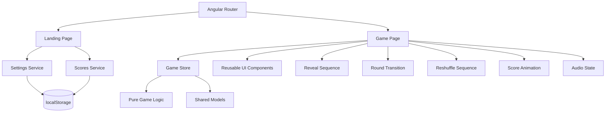

<div align="center">

# Mahjong High-Low

### A Mahjong-inspired higher-or-lower game built with Angular

Compare hands, predict whether the hidden hand is higher or lower, build a winning streak, and survive until the tiles reach their limits.

[**Play the Game**](https://memezsxz.github.io/mahjong/) · [**Code Documentation**](https://memezsxz.github.io/mahjong/docs/index.html)


</div>

---

## Overview

**Mahjong High-Low** is a responsive single-page game built with Angular.

The player is shown one Mahjong hand and must predict whether the hidden hand has a **higher** or **lower** total value.

Each round moves through a staged deal, prediction, reveal, score update, and hand transition. Winning rounds build score and streaks, while tile values evolve throughout the run.

The project focuses on reusable game logic, reactive state management, animation sequencing, persistent player settings, and a polished responsive interface for desktop and mobile play.

> Mahjong High-Low uses Mahjong tiles and visual themes, but it is an original higher-or-lower game rather than a traditional Mahjong rules implementation.

---

## Live Demo

### Play

https://memezsxz.github.io/mahjong/

### Documentation

https://memezsxz.github.io/mahjong/docs/index.html

Both the game and generated Compodoc documentation are deployed automatically to GitHub Pages from the `no-nx` branch.

---

## Gameplay

The game begins on the landing page, where the player can:

* Start a new run
* View the rules
* Configure game settings
* View the local leaderboard

Once a run begins:

1. A visible hand and hidden hand are dealt.
2. The player predicts whether the hidden hand is **Higher** or **Lower**.
3. The hidden hand is revealed.
4. The result is resolved.
5. Score and streak values are updated.
6. Tile values are adjusted.
7. The revealed hand becomes the basis for the next round.
8. New tiles are drawn and the run continues.

The game ends when one of the configured game-over conditions is reached.

---

## Game Rules

Core game rules are centralized in:

```text
src/app/libs/util-game/game.config.ts
```

Current configuration:

| Rule                      |   Value |
| ------------------------- | ------: |
| Default hand size         |       6 |
| Available hand sizes      | 3, 4, 6 |
| Minimum tile value        |       0 |
| Maximum tile value        |      10 |
| Honor tile starting value |       5 |
| Maximum win streak        |       3 |
| Maximum reshuffles        |       3 |

Keeping these values in one configuration module separates game rules from presentation and animation logic.

---

## Scoring & Progression

Each prediction resolves as either a win or loss based on the total values of the visible and hidden hands.

The game tracks:

* Current score
* Consecutive wins
* Hand history
* Draw-pile size
* Discard-pile size
* Reshuffles
* Tile values
* Previous round results

The sidebar presents the player's current run information while the round is active.

---

## Reshuffling

Tiles move between the draw and discard piles as rounds progress.

When the draw pile can no longer provide the required hand, the game can perform a reshuffle sequence using discarded tiles.

A run currently allows up to:

```text
3 reshuffles
```

before reaching the configured reshuffle limit.

The reshuffle process has its own UI and animation sequence rather than immediately replacing the deck state.

---

## Leaderboard

Mahjong High-Low maintains a local top-score leaderboard.

The leaderboard:

* Stores up to **5 scores**
* Orders entries by score
* Uses the most recent entry as the tie-breaker
* Only accepts positive scores
* Persists entries through browser `localStorage`

Players whose final score qualifies can name their run before submitting it.

Leaderboard data is stored locally in the browser and is not shared between devices.

---

## Player Settings

Player preferences are also persisted using `localStorage`.

Available settings include:

* Hand size
* Music
* Sound effects
* Animations
* Tile-value visibility
* Tutorial state

Supported hand sizes are read directly from the centralized game configuration.

---

## Responsive Design

The game is designed for both desktop and smaller screens.

The game interface includes:

* Responsive hand layouts
* Desktop sidebar
* Mobile sidebar interaction
* Responsive settings panels
* Touch-friendly controls
* Adaptive game-stage sizing

The mobile game sidebar can be opened and closed using pointer-driven interactions.

---

## Architecture

The application separates game rules, state, data access, reusable UI, and route-level features.



### Game Page

`GamePage` acts as the main orchestration layer during a run.

It coordinates:

* Game state
* Player bets
* Deal timing
* Reveal sequences
* Round transitions
* Score animations
* Reshuffling
* Audio
* Settings
* Exit handling
* Mobile UI behavior

Complex animation and transition logic is delegated into dedicated services rather than being kept entirely inside the page component.

---

## Project Structure

```text
src/app/
├── features/
│   ├── landing-page/
│   └── game-page/
│
└── libs/
    ├── data-access/
    ├── models/
    ├── ui/
    └── util-game/
```

### `features/`

Contains route-level application features.

#### `landing-page`

Contains the starting screen, leaderboard access, settings, and navigation into the game.

#### `game-page`

Contains the active game experience and services responsible for round orchestration and animations.

### `libs/data-access`

Contains stateful application services such as:

* Game state
* Audio
* Scores
* Player settings

### `libs/models`

Contains shared TypeScript interfaces, enums, and data models.

### `libs/ui`

Contains reusable presentation components such as:

* Hands
* Tiles
* Bet controls
* Score display
* Deck counters
* Hand history
* Settings panel

### `libs/util-game`

Contains game rules and pure utility logic that can remain independent of the UI.

---

## Technology Stack

| Area                 | Technology              |
| -------------------- | ----------------------- |
| Framework            | Angular 21.2            |
| Language             | TypeScript 5.9          |
| State Management     | NgRx Signals            |
| UI Components        | PrimeNG 21              |
| Styling              | Tailwind CSS 4          |
| Icons                | PrimeIcons              |
| Reactive Programming | RxJS                    |
| Routing              | Angular Router          |
| Offline Caching      | Angular Service Worker  |
| Unit Testing         | Jasmine + Karma         |
| Linting              | ESLint + Angular ESLint |
| Formatting           | Prettier                |
| Documentation        | Compodoc                |
| Deployment           | GitHub Pages            |
| CI/CD                | GitHub Actions          |

---

## Offline Support

Production builds include Angular's service worker.

Application resources and image assets are cached according to:

```text
ngsw-config.json
```

This allows repeat visits to load cached application resources and game assets without requiring every resource to be fetched again.

---

## Getting Started

### Requirements

The GitHub Pages deployment currently builds using:

```text
Node.js 20
```

You will also need:

* npm
* Git

The Angular CLI is installed as a project dependency, so a global Angular installation is not required.

### 1. Clone the Repository

```bash
git clone https://github.com/memezsxz/mahjong.git
cd mahjong
```

### 2. Install Dependencies

```bash
npm ci
```

### 3. Start the Development Server

```bash
npm start
```

or:

```bash
npx ng serve
```

Then open:

```text
http://localhost:4200/
```

The application automatically reloads when source files change.

---

## Build

Create a production build with:

```bash
npm run build
```

The production configuration enables the Angular service worker.

---

## Testing

Run the Jasmine/Karma test suite with:

```bash
npm test
```

---

## Linting

Run ESLint with:

```bash
npm run lint
```

---

## Formatting

Format the repository with Prettier:

```bash
npx prettier --write .
```

Check formatting without modifying files:

```bash
npx prettier --check .
```

---

## Documentation

Generate the Compodoc documentation with:

```bash
npm run docs
```

The command outputs the generated documentation into the production build directory so it can be deployed alongside the game.

The hosted version is available at:

https://memezsxz.github.io/mahjong/docs/index.html

---

## Deployment

Deployment is automated through GitHub Actions.

A push to:

```text
no-nx
```

triggers the GitHub Pages workflow.

The workflow:

1. Checks out the repository.
2. Configures Node.js 20.
3. Runs `npm ci`.
4. Builds the Angular application with the `/mahjong/` base path.
5. Generates Compodoc documentation.
6. Creates a `404.html` fallback for client-side routing.
7. Publishes the generated site to the `gh-pages` branch.

---

## Development Notes

Game-rule configuration is intentionally separated from animation timing and presentation logic.

Important locations include:

```text
src/app/libs/util-game/game.config.ts
```

Core rules and limits.

```text
src/app/features/game-page/game-page.animations.ts
```

Game-page reveal, deal, score, and transition timing.

```text
src/app/libs/ui/game-ui.animations.ts
```

Shared hand, tile, deck, and UI animation timing.

```text
src/app/libs/data-access/game-audio-manager.service.ts
```

Music and sound-effect configuration.

```text
src/app/libs/data-access/scores.service.ts
```

Leaderboard persistence and qualification logic.

```text
src/app/libs/data-access/settings.service.ts
```

Persistent player settings.

---

## AI-Assisted Development

AI tools were used as development aids during this project for iteration, implementation assistance, and refinement.

The game's animation work received the heaviest AI assistance.

The application's overall architecture, gameplay systems, state design, styling direction, feature development, and integration were primarily implemented and directed manually.

---

## Project Status

Mahjong High-Low is a complete playable web game and is deployed publicly through GitHub Pages.
